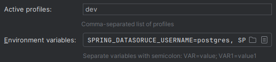

# Gimnasio Sport

Proyecto del Práctico Integrador I de Ingeniería de Software II.

## Preparación del entorno

Para que la app funcione, debe estar configurada correctamente la conexión a la base de datos. Para ello, debe estar ejecutándose PostgreSQL, y debe existir una base da datos con el nombre "gimnasio".

Luego hay que hacer dos cosas. Configurar las credenciales de la base de datos, y activar el perfil "dev".

Las credenciales de la base de datos se configuran mediante las siguientes variables de entorno. Hay que setearlas en el IDE, o en la terminal, dependiendo de desde dónde queramos ejecutar la app.

```
SPRING_DATASOURCE_USERNAME=usuario
SPRING_DATASOURCE_PASSWORD=contraseña
```

Para que la app se ejecute en modo dev, hay que cambiar la configuración de ejecución del IDE. Si el IDE no trae esta opción (IntelliJ sí), simplemente se puede setear la siguiente variable de entorno (igual que las anteriores).

```
SPRING_PROFILES_ACTIVE=dev
```

### a) Ejemplo en IntelliJ

1) Editar la configuración de ejecución.

    

2) Añadir "dev" como perfil activo y setear las variables de entorno mencionadas. La sección de "Variables de entorno" puede que esté oculta, pero se puede añadir desde ese mismo menú.

    


### b) Ejemplo en la terminal

1) Setear las variables de entorno (solo hace falta una vez hasta que se cierre la terminal).

    ```bash
    export SPRING_DATASOURCE_USERNAME=usuario
    export SPRING_DATASOURCE_PASSWORD=contraseña
    export SPRING_PROFILES_ACTIVE=dev
    ```

3) Ejecutar el siguiente comando dentro del directorio `backend/` para compilar y ejecutar la app.

    ```bash
    ./mvnw spring-boot:run
    ```


## Empaquetado

Si queremos empaquetar la app en un .jar, solo hay que ejecutar el siguiente comando dentro del directorio `backend/`:

```bash
./mvnw package
```

El .jar se creará en el directorio `target/`. Se puede ejecutar con `java -jar nombre_del_archivo.jar`. Para que se ejecute correctamente, hay que setear las variables de entorno ya mencionadas (en este caso, en la terminal).